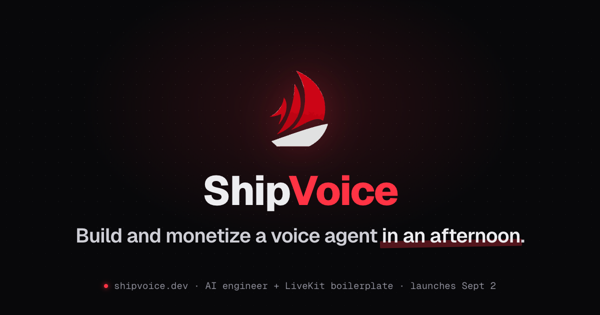
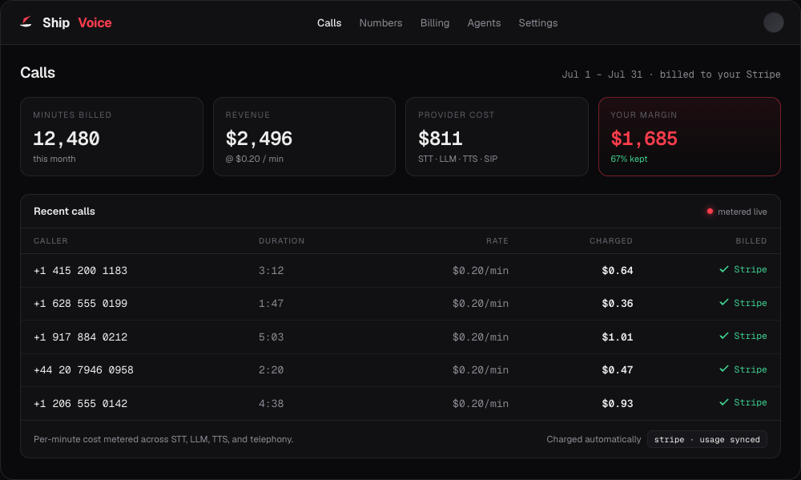

<picture>
  <source media="(prefers-color-scheme: dark)" srcset="assets/banner-dark.webp">
  <source media="(prefers-color-scheme: light)" srcset="assets/banner-light.webp">
  
</picture>

<h1 align="center">ShipVoice</h1>

<p align="center">
  <b>Talk to an AI agent in your browser, in minutes.</b><br/>
  A full-stack, production-minded starter for real-time voice agents: a LiveKit
  voice worker, a FastAPI token server, and a React frontend built on LiveKit's
  Agents UI, wired together and ready to extend.
</p>

<p align="center">
  <a href="https://livekit.io"></a>
  
  <a href="https://www.python.org"></a>
  <a href="https://fastapi.tiangolo.com"></a>
  <a href="https://react.dev"></a>
  <a href="https://www.typescriptlang.org"></a>
  <a href="https://tailwindcss.com"></a>
</p>

<p align="center">
  <a href="LICENSE"></a>
  <a href="../../issues"></a>
</p>

---

Most voice-AI demos are a single script. This is the whole loop, structured the
way you'd actually ship it, and split into three pieces you can run, deploy, and
swap independently.

> This gets you a voice agent you own. Turning one into a product you charge for
> is a separate problem, and it is what [ShipVoice Pro](https://shipvoice.dev)
> is: per-call cost metered by provider, per-minute Stripe billing, auth with an
> entitlement gate, compliance gates that fail closed, and a console that shows
> what every call cost you. It is its own repository, not a plugin for this one.

## What's inside

| Package         | What it is                                                                                                                                                                  |
| --------------- | --------------------------------------------------------------------------------------------------------------------------------------------------------------------------- |
| **`agent/`**    | A LiveKit voice worker: Deepgram `nova-3` STT, Cerebras `gemma-4-31b`, Inworld TTS, Silero VAD, and the LiveKit multilingual turn detector. Web and SIP, explicit dispatch. |
| **`backend/`**  | A FastAPI service that mints LiveKit room tokens (`POST /api/v1/token`), with a clean API → service → repository layout you copy to add resources.                          |
| **`frontend/`** | React + Vite + Tailwind using LiveKit's Agents UI components: audio visualizer, live transcript, and text chat.                                                             |

Typed end to end, tested, linted, with CI and a pre-commit hook across all three.

## How it fits together

```
  React app  ──POST /api/v1/token──▶  Backend  ──signs token──▶  React joins room
      │                                                               │
      └───────────────── connects to LiveKit room ◀──────────────────┘
                                   │
                  agent_name dispatches  ──▶  Agent worker joins
                                   │
                         mic ▶ STT ▶ LLM ▶ TTS ▶ speaker  (over WebRTC)
```

The backend and agent share the same LiveKit credentials, so a backend-minted
token is valid for the room the agent joins. Works against self-hosted LiveKit
or LiveKit Cloud.

## Run with Docker

The fastest path. One command brings up Postgres, the backend, the agent, and the
frontend together:

```bash
cp .env.example .env     # the values it asks for, each needing an account
docker compose up --build
```

Open `http://localhost:5173`, go to **Agents**, and hit **Start test call**. Uses
an external LiveKit project (a free LiveKit Cloud project works). The backend
brings the schema up to head on startup, so there is no migration step.

Something not working? Do not guess, ask:

```bash
cd agent && uv run python ../scripts/doctor.py --live
```

It names the cause and the fix. Every failure in this stack is quiet: a
mismatched agent name mints a valid token, opens a real room, and produces no
error anywhere.

## Run manually

You'll need a LiveKit project (URL + API key/secret) and provider keys
(Deepgram, Cerebras, Inworld). Run each in its own terminal:

```bash
# 1. Backend: token server (http://localhost:8000)
cd backend && cp .env.example .env   # add LIVEKIT_* + the database
uv sync && uv run uvicorn src.main:app --reload

# 2. Agent: voice worker
cd agent && cp .env.example .env      # add LIVEKIT_* + the three provider keys
uv sync && uv run python main.py dev

# 3. Frontend: web client (http://localhost:5173)
cd frontend && cp .env.example .env   # point VITE_TOKEN_ENDPOINT at the backend
pnpm install && pnpm dev
```

Open `http://localhost:5173`, go to **Agents**, start a test call, allow the mic, and talk.

> **The fastest proof it works**, before any of the above: `cd agent && uv run
> python main.py console` runs the whole speech to model to speech loop in your
> terminal with just the three provider keys. No LiveKit, no backend, no
> database.

## Stack

| Layer           | Default                                                                       |
| --------------- | ----------------------------------------------------------------------------- |
| STT / LLM / TTS | Deepgram `nova-3` · Cerebras `gemma-4-31b` · Inworld `inworld-tts-2`         |
| Realtime        | LiveKit Agents (`livekit-agents`), WebRTC, Silero VAD, turn detector          |
| Backend         | FastAPI, async SQLModel/Postgres, dependency-injector, `livekit-api`          |
| Frontend        | React 19, Vite, TypeScript, Tailwind v4, shadcn + LiveKit Agents UI           |
| Tooling         | uv, ruff, mypy, pytest · ESLint, Vitest · pre-commit, GitHub Actions, Codecov |

## Highlights

- **One command per service** to run locally; one `.env.example` each.
- **Web and telephony** (SIP) on the same agent, via a single participant branch.
- **Swappable providers** and self-hosted ↔ LiveKit Cloud with a one-line change.
- **Zero-downtime deploys**: the worker drains in-flight calls on SIGTERM (blue/green on Fly), so a deploy mid-call finishes the call instead of dropping it.
- **Edit the persona in the console**: the prompt is a file the worker re-reads on every call, so a save from the Agents page is live on the next one with nothing restarted.
- **Standard token endpoint** so LiveKit client SDKs connect with zero glue.
- **Copy-to-extend** patterns: an API to service to repository slice in the backend, a bare `Assistant` in the agent.

## Charge for it: ShipVoice Pro

<a href="https://shipvoice.dev">
  
</a>

This starter gets you a voice agent. It does not get you a business. The part
that does not one-shot is metering, billing, auth, telephony registration, and
compliance, and that is what **[ShipVoice Pro](https://shipvoice.dev)** ships.

It is a separate repository that shares this one's stack and lineage. It is not
a plugin for this repo and does not depend on it.

- **An AI engineer**: describe an agent in one line and its subagents generate it, then a validation gate refuses to ship one that is malformed. No gallery to pick from.
- **Own your margin**: every minute of STT, LLM, TTS, and telephony metered per provider, so each call carries a cost you can read.
- **Per-minute billing**: Stripe Billing Meters, checkout, and webhook, wired.
- **Auth and entitlement**: end-user accounts behind a paid entitlement gate.
- **Compliance machinery**: consent records, a suppression list, and a callee-local calling window, advisory by default with a strict opt-in.
- **Telephony (SIP / PSTN)** with a 10DLC registration runbook.
- **One-command deploy** to Fly.

<a href="https://shipvoice.dev">
  
</a>

<p align="center"><i>Console shown with sample data.</i></p>

Lifetime updates. Launches September 2, 2026: [shipvoice.dev](https://shipvoice.dev)

## Docs

Each package has its own README with details:
[`agent/`](agent/README.md) · [`backend/`](backend/README.md) · [`frontend/`](frontend/README.md)

## Where your secrets live

The values you fill in stay in `.env`, which is gitignored. One thing moves:
the first time the backend starts it copies the LiveKit project into Postgres,
and the console edits it there. So after that, **your LiveKit signing secret is
stored unencrypted in the `livekit_settings` table**, which means it is also in
the `pgdata` volume and in any database dump you take. Rotating the key in your
LiveKit project is the revocation path.

The backend has no authentication. Do not put it on a public address without
something in front of it, and leave `CONSOLE_WRITES_ENABLED` off anywhere that
is not your own machine.

## Third-party code

Some UI components are vendored from public component registries and are
licensed by their upstream authors, not by this repository. See
[`THIRD_PARTY_NOTICES.md`](THIRD_PARTY_NOTICES.md).

## License

MIT for the code written here. See [`LICENSE`](LICENSE) and the note above.
